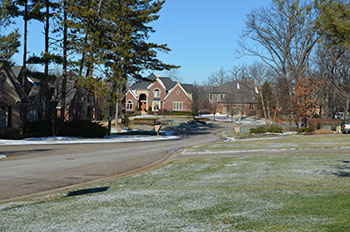

#DGMD-E-27-Spring2016-P2

This is the second assignment for DGMD E-27.

#Source Code

The code consists of the following files:

##Source HTML/php:
**index.php** - This is the landing page for the site. It consists of a header at the top with an image the is swapped using media queries. There is also a main section that has some text describing the site and neighborhood as well as some responsive images that use picturefill.js. There is also a sidebar that incorporates a weather widget using the openweather API.

**photogallery.php** - This is a page for showing various neighborhood photo albums which could be accessed by clicking on the image. The images currently do not link anywhere but could later. There is no weather sidebar on this page but this page incorporates the equal heights javascript code from Ben Howdle (http://benhowdle.im/easy-peasy-equal-heights.html).

**thingstodo.php** - This is a page for showing pictures of things to do in the city where my neighborhood resides. This page also shows the column swapping when going from desktop to mobile portrait mode as described in the week 3 videos. This page also uses more media queries around the end points for the typical media queries to maximize the image sizes for the appropriate screen widths.

**contact.php/login.php/register.php** - These are all form based php files with the weather widget side bar on the right side.

##CSS Source Files:
**normalize.css** - The stylesheet that normalizes everything between browsers.<br>
**styles.css** - The main overall stylesheet for the site. This has media queries in it.<br>
**weather-style.css** - Weather widget sidebar specific stylings.<br>
**formstyle.css** - Form specific stylesheet.<br>

##JS Source Files:
**eqheight.js** - Javascript code from Ben Howdle that makes columns the same heights.<br>
**menu.js** - jQuery code snippet that toggles classes to make a mobile responsive menu. It uses a "hamburger button" in the mobile portrait mode.<br>
**openWeather.js** - jQuery code snippet from Michael Lynch (http://michaelynch.com) distributed under MIT license to access the OpenWeather API.<br>

# Assignment Specific Topics
## Browser/Operating System
I primarily used a Google Chrome browser (Version 48.0.2564.116 m) running on a Windows 10 (64 bit) machine and Safari running on an Apple iPhone 6s plus (iOS 9.2.1).
## Grid System
The grid system uses four (4) columns and the CSS layout (styles.css) is shown below...

```
/* grid system */

.row::after {
    content:"";
    display: table;
    clear:both;
} 

[class*='col-'] {
	float: left;
	min-height: 1px;
}
.col-1 {
	width: 25%;
}
.col-1-2-4 {
	width: 25%;
}
.col-2 {
	width: 50%;
}
.col-3 {
	width: 75%;
}
.col-4 {
	width: 100%;
}
```

.col-1-2-4 goes to 50% width in mobile phone landscape screen sizes and 100% in mobile phone portrait (as do all the columns).

##Used Typefaces
This code uses two google typefaces, Lato (for the general paragraph text) and Francois One (for the heading text)...They are linked in to each source file using the source below.<br>
```
<link href='https://fonts.googleapis.com/css?family=Francois+One' rel='stylesheet' type='text/css'>
<link href='http://fonts.googleapis.com/css?family=Lato&subset=latin,latin-ext' rel='stylesheet' type='text/css'>
```	
Although they look similar, these two typefaces are contrasting due to how they are used and the weighting applied to each. The Lato paragraph text is not weighted heavily while the Francois One heading text is heavier... They are not mixed together so it does not give the appearance of a mistaken typeface. Also, there is actually a website (http://fontpair.co/) that suggests which fonts go together nicely and Lato and Francois One was mentioned as a nice combination of typefaces.

## Responsive/Scaling Typography
Using the recommendations from the link given in class as a starting point (http://typecast.com/blog/a-more-modern-scale-for-web-typography), I scaled both the font-size and the line-height for the various media queries. The two main areas where this comes into play is in the main section of index.php and photogallery.php. The selected source CSS (styles.css) is shown below.

```
/* media queries */

/* Desktop Screen Sizes */
/* Pixel Range: >= 1050px; */
@media only screen and (min-width: 1050px) {
...
	main h2, div.photogallery h2 {
		font-size: 2.5em;
		line-height: 1.25em;		
		padding-left: 0.25em;
		padding-right: 0.25em;
	}
	main p, div.photogallery p {
		font-size: 1.5em;
		line-height: 1.1;
		margin-left: 0.25em;
		margin-right: 0.25em;
	}
...
}

/* Tablet Screen Sizes */
/* Pixel Range: >= 768px; */
@media only screen and (min-width: 768px) and (max-width: 1049px) {
...
	main h2, div.photogallery h2 {
		font-size: 2.25em;
		line-height: 1.2em;
		padding-left: 0.2em;
		padding-right: 0.2em;
	}
	main p, div.photogallery p {
		font-size: 1.25em;
		line-height: 1.15em;
		margin-left: 0.2em;
		margin-right: 0.2em;
	}	
...
}

/* Mobile Landscape Screen Sizes */
/* pixel range: 480-767px */
@media only screen and (min-width: 480px) and (max-width: 767px)  {
...
	main h2, div.photogallery h2 {
		font-size: 1.75em;
		line-height: 1.15em;		
		padding-left: 0.15em;
		padding-right: 0.15em;
	}
	main p, div.photogallery p {
		font-size: 1.1em;
		line-height: 1.1em;
		margin-left: 0.15em;
		margin-right: 0.15em;	
	}
...
}

/* Mobile portrait Screen Sizes */
/* pixel range: <=479px */
@media only screen and (max-width: 479px)  {
...
	main h2, div.photogallery h2 {
		font-size: 1.5em;
		line-height: 1.2em;		
		padding-left: 0.1em;
		padding-right: 0.1em;
	}
	main p, div.photogallery p {
		font-size: 1em;
		line-height: 1.15em;
		text-align: center;
	}
...
}
```
## Responsive Images

Responsive images are handled two ways...
1.) Swapping background images based using media queries
2.) Using Picturefill.js

### Swapping the background header image using media queries

The header background image changes based on screen width. There are four (4) different background images for the header depending on the screen width. The header image is in all the pages for the site... The source html and css code is shown below...

####HTML
```
		<div class="row">
			<header class="col-4">
			</header>
		</div>
```

####CSS (styles.css)
```
@media only screen and (min-width: 1050px) {
	header {
		background: url(../images/sog-entrance-1200.jpg) no-repeat;
		width: 1200px;
		height: 300px;
		font-family: 'Lato', sans-serif; 
		color: #fff;
	}
	...
}

@media only screen and (min-width: 768px) and (max-width: 1049px) {
	header {
		background: url(../images/sog-entrance-1000.jpg) no-repeat;
		width: 1000px;
		height: 300px;
		font-family: 'Lato', sans-serif; 
		color: #fff;
	}
	...
}

@media only screen and 
	(min-width: 480px) and (max-width: 767px)  {

	header {
		background: url(../images/sog-entrance-800.jpg) no-repeat;
		width: 800px;
		height: 300px;
		font-family: 'Lato', sans-serif; 
		color: #fff;
	}
	...
}

@media only screen and (max-width: 479px)  {

	header {
		background: url(../images/sog-entrance-500.jpg) no-repeat;
		width: 500px;
		height: 255px;
		font-family: 'Lato', sans-serif; 
		color: #fff;
	}
	...
}
```
### Swapping images using Picturefill.js
Images in the main section of index.php are swapped based on screen width using picturefill. The source HTML code is shown below.

```
		<!-- Using picturefill, load different pictures depending on the width of the screen
		This picture is in the upper left hand corner of the main section under the <h2> title... -->
		<picture class="first_main_pic">
			<!--[if IE 9]><video style="display: none;"><![endif]-->
			<source srcset="images/sog-entrance-drive-orig-350.jpg" media="(min-width: 1050px)">
			<source srcset="images/sog-entrance-drive-orig-250.jpg" media="(min-width: 768px) and (max-width: 1049px) ">
			<source srcset="images/sog-entrance-drive-orig-200.jpg" media="(min-width: 480px) and (max-width: 767px) ">
			<!--[if IE 9]></video><![endif]-->
			
		</picture>
```

and

```
		<!-- Using picturefill, load different pictures depending on the width of the screen
		This picture is in the lower right hand corner of the main section -->
		<picture class="second_main_pic">
			<!--[if IE 9]><video style="display: none;"><![endif]-->
			<source srcset="images/sog-entrance-sign-250.jpg" media="(min-width: 1050px)">
			<source srcset="images/sog-entrance-sign-200.jpg" media="(min-width: 768px) and (max-width: 1049px) ">
			<source srcset="images/sog-entrance-sign-150.jpg" media="(min-width: 480px) and (max-width: 767px) ">
			<!--[if IE 9]></video><![endif]-->
			
		</picture>
```
## Navigation Bar
The navigation bar is located on every page immediately below the header image. The source HTML code is in all the source files in a row underneath the header as expeted and is shown below.
```
	<div class="col-4 menu">
		<ul class="active-toggle">
			<li class="active"><a href="./index.php">Home</a></li>
			<li><a href="#">About</a></li>
			<li><a href="#">Things to Do</a></li>
			<li><a href="./photogallery.php">Photo Gallery</a></li>
			<li><a href="./login.php">Login</a></li>
			<li><a href="./register.php">Register</a></li>
			<li><a href="./contact.php">Contact Us</a></li>
		</ul>
		<a class="toggle-nav" href="#">&#9776;</a>
	</div>
```
The classes "active-toggle" and "toggle-nav" are used by the jquery toggle functionality to switch between the "Hamburger Button" mode and regular menu. The "active" class just highlights the current page on the menu. The jQuery source (menu.js) is shown below.
```
jQuery(document).ready(function() {
    jQuery('.toggle-nav').click(function(event) {
        jQuery(this).toggleClass('active-toggle');
        jQuery('.menu ul').toggleClass('active-toggle');
 
        event.preventDefault();
    });
});
```
The navigation menu is also responsive and scales with the media queries.

## Inside page: column swapping
Although it wasn't mentioned in the actual assignment page, the week 3 video states that we need to swap a column based on media query. This is done in the `thingstodo.php` source file. Similar to the video example, I added an aside that has various stats about Commerce Township, the city where my neighborhood is located.<br>
This column is the left most column in non mobile portrait modes but using the following snippets of css code, it is shown after the main section.<br>

The css for mobile portrait sizes... From `thingstodo.css`

```
/* Mobile Portrait Screen Sizes */
/* pixel range: <480px */	
@media only screen and (max-width: 479px)  {
...
	/* Keep the columns in the original order in the
	   mobile portrait mode screen size */	
  	.col-push-1,
	.col-pull-3 {
		left: 0;
	}
	.thingstodo_main_left_pic, .thingstodo_main_right_pic {
		width: 100%;
	}	 
}
```
The css for all other screen sizes... Also from `thingstodo.css`

```
/* rearranging the columns */
[class*="col-"] {
	position: relative;
}
.col-push-1 {
	left: 25%;
}
.col-pull-3 {
	left: -75%;
	background-color: #EEDFAF;	
}
```

Normally as written the aside, which contains the Commerce Township info is the col so would be the rightmost column. By rearranging the columns as shown above with relative position, we can move this aside column to the left for non mobile portrait screen sizes and keep it last when in mobile portrait mode...

